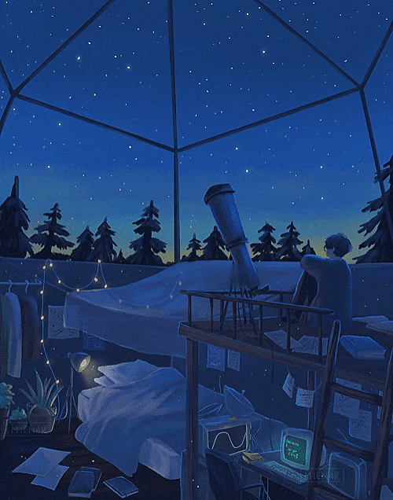

  

  
  

## 🙋‍♂️ [ About Me ]

    

 

📍 Based in France

💼 Freelance FullStack Developer & DevOps

## 🚀 [ Currently Working On ]

### 💼 Professional Development

*Freelance web & DevOps projects*

## 🧠 [ Skills ]
  <picture>
    <source media="(prefers-color-scheme: light)" srcset="resources/landscape.gif" align="right" width="40%">
    
  </picture>

### 🎯 • Expertise Levels

  
**Frontend Development:** ████████░░ 80%  
**Backend Development:** ██████░░░░ 60%  
**DevOps (Novice):** ███░░░░░░░ 30%  

### 🌐 • Web Development Stack

### ☁️ • DevOps & Hosting

### 🛠️ • Development Tools & Environment

### 🏆 • Certifications & Achievements

## ⭐ [ Featured Projects ]

*🚧 Featured repositories coming soon! Currently focusing on client projects and learning new technologies.*

<!-- Une fois que vous aurez des repos publics à mettre en avant :

-->

## 📊 [ Github Analytics ]

     
  
  

    
    
  

   
  

## 💭 [ Fun Facts ]

  

---

  <i>⭐ From <a href="https://github.com/IMTR0J4N">IMTR0J4N</a> - Always learning, always growing! 🚀</i>

